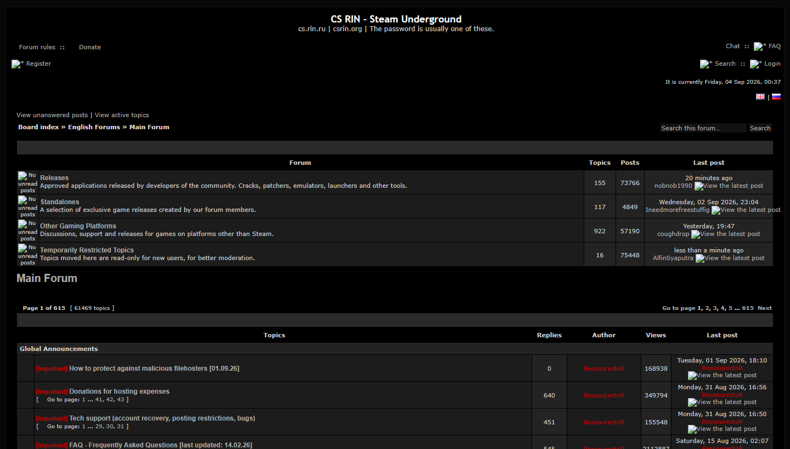
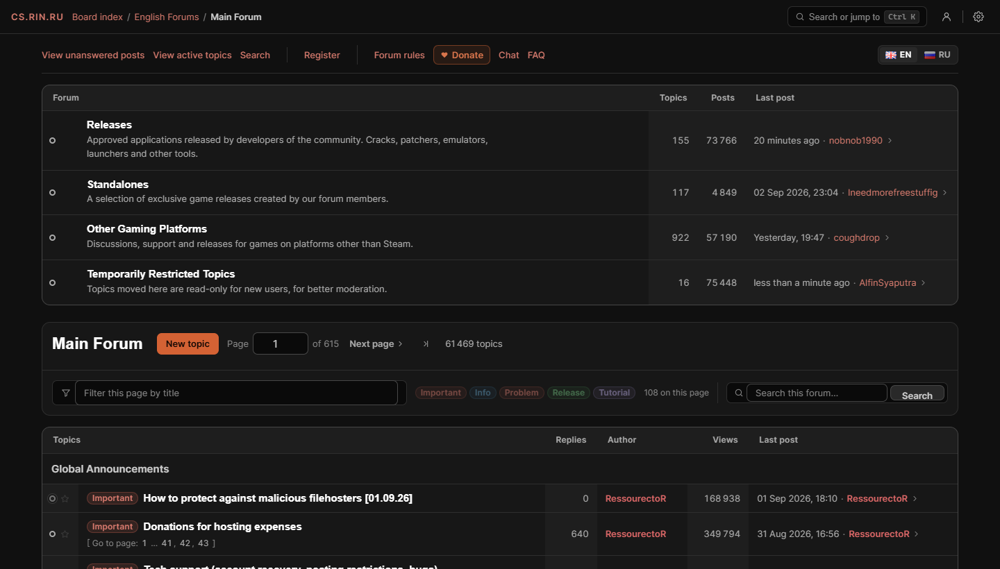
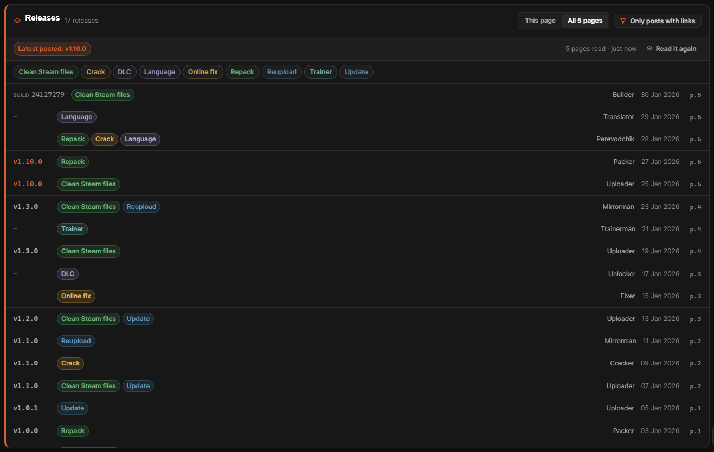

# RIN Reforged

A userscript that rebuilds the [CS.RIN.RU](https://cs.rin.ru/forum/) forum:
modern themes, real mobile support, a game info card, a releases finder, a
command palette and a settings panel — without changing anything on the board
itself.

| Before | After |
| --- | --- |
|  |  |

## Install

1. Install a userscript manager:
   [Violentmonkey](https://violentmonkey.github.io/) or
   [Tampermonkey](https://www.tampermonkey.net/).
2. **[Click here to install RIN Reforged](https://raw.githubusercontent.com/Shirowwww/rin-reforged/main/dist/rin-reforged.user.js)** —
   the manager will open an install prompt.
3. Open <https://cs.rin.ru/forum/>. You should see a slim dark bar at the top
   with the board name on the left and a search box on the right. Press `?` for
   the shortcut list, or click the cog for settings.

**Updates are automatic.** The script declares an update URL, so your manager
checks this repository and offers new versions on its own.

> **Chrome / Edge with Tampermonkey** need Developer Mode switched on at
> `chrome://extensions` before any userscript runs. Violentmonkey does not.

## What it does

- **Four themes** — Native (the board's own black/grey/red, the default),
  Slate, Carbon and a real light theme — six accent colours, three densities
  and an adjustable text size.
- **Works on a phone.** The board ships no viewport tag and lays everything out
  in fixed tables; the script injects the tag and unpacks them into stacked
  blocks.
- **Finds the current version.** A **Releases** panel lists everything ever
  posted in a topic — release, update, repack, crack, hypervisor crack, clean
  Steam files, online fix, DLC unlocker, trainer, language pack, tool — with
  its version, who posted it, when, and which page it is on. The highest
  version anybody posted is called out at the top.
- **Game info card** on the first post of a game thread: header art, AppID,
  developer, publisher, release date, genres and languages, with the Steam
  marketing copy folded away and lookups to SteamDB, the store, SteamCharts,
  ProtonDB and PCGamingWiki.
- **Gets you around** — `Ctrl+K` command palette, keyboard shortcuts, a real
  pager that links the last page, filter-as-you-type over a listing, coloured
  topic tags, bookmarks and history kept in your browser.
- **Optional Steam preview** on hover over a topic title: cover, review score,
  tags and the opening lines of the store description. This is the only thing
  in the script that talks to a server other than the forum, so it is **off
  until you turn it on**, and refused outright on the Tor mirror.
- **Better posting** — quick reply from the foot of the thread, quote what you
  select, an unsent reply kept in your browser, long quotes and low-value
  replies folded (never removed), images in a lightbox.
- **Readable, and measured.** Every colour this script paints meets WCAG AA on
  all four themes — 8 748 pieces of text checked across five pages, and the
  check fails the build if one slips. The board's own group-coloured usernames
  are kept and lifted too: same hue, the least change in brightness that makes
  them readable, and a switch to leave them exactly as the board wrote them.

Every feature has a switch, with a sentence saying what it does. Open the
settings panel with the cog in the top bar.



## Notes

- **Nothing is written to the board.** Disabling the script leaves no trace.
- **It does not bypass anything.** Links behind "Please login to see this link"
  stay hidden, the reply form is the board's own.
- **The Tor mirror works** — the `@match` covers the `.onion` address.
- **Running alongside [CS.RIN.RU Enhanced](https://github.com/SubZeroPL/cs-rin-ru-enhanced-mod)**
  is fine. The two overlap in a couple of places; RIN Reforged detects it and
  stands down on those by default (*Behaviour → Stand down for CS.RIN.RU
  Enhanced*).
- **Private or container windows** get their own storage, so bookmarks, history
  and settings do not follow you into one.

## Building

No dependencies, no transpiling — the sources in `src/` are plain scripts
stitched into one userscript.

```sh
node build.js                  # -> dist/rin-reforged.user.js
node --check dist/rin-reforged.user.js
```

`dist/rin-reforged.user.js` is committed, because that is the file people
install. CI rebuilds it and fails if it does not match `src/`.

## Testing

`test/` renders saved copies of real board pages with the built script
attached, so changes are checked against the actual markup.

```sh
npm i -D playwright-core
node test/make-quotes-fixture.js   # regenerate the synthesised fixtures
node test/prepare.js               # build test/pages from test/fixtures
python test/serve.py &             # http://localhost:8731
export RR_CHROME=/path/to/chrome

node test/check.js                 # every page, 7 widths, 9 settings combinations
node test/features.js              # does each feature still do its job
node test/live.js                  # the same, against cs.rin.ru itself
node test/contrast.js              # every colour, every theme, against WCAG AA
node test/scan.js --local --repeat # what reading a whole topic costs
node test/perf.js                  # what the script costs to run
```

More in [docs/DESIGN.md](docs/DESIGN.md): why each feature works the way it
does, and what the tests are actually proving.

## Credits

- The board, and the staff who keep it running.
- [CS.RIN.RU Enhanced](https://github.com/SubZeroPL/cs-rin-ru-enhanced-mod) by
  RoyalGamer06, SubZeroPL, Reddiepoint and Altansar69 — the prior art here.
- [Revereor](https://github.com/ltguillaume/phpbb-revereor) and
  [damaio](https://github.com/cabot/damaio), two modern phpBB styles.

## License

[Unlicense](UNLICENSE.txt) — public domain.
