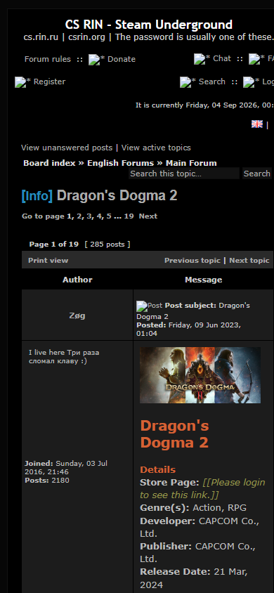
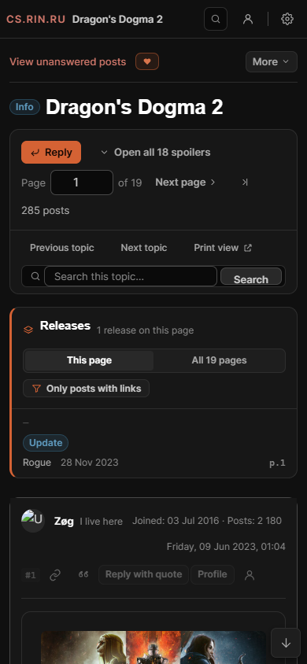
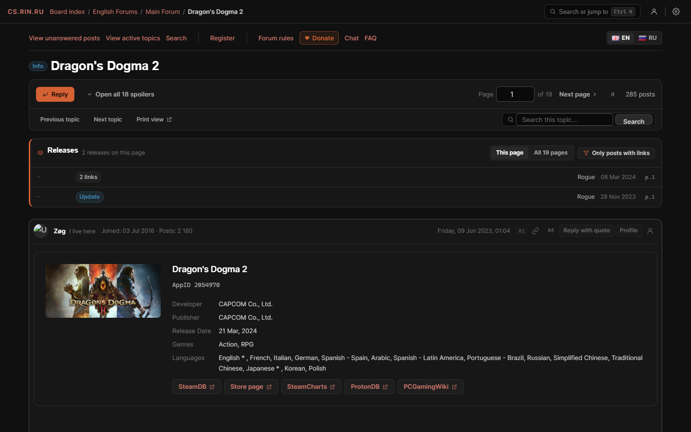
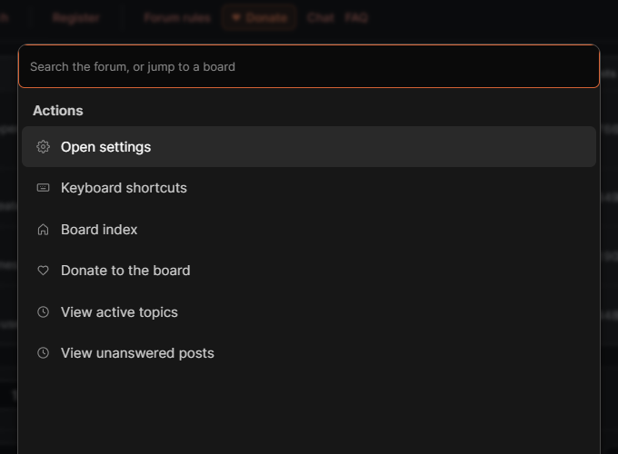
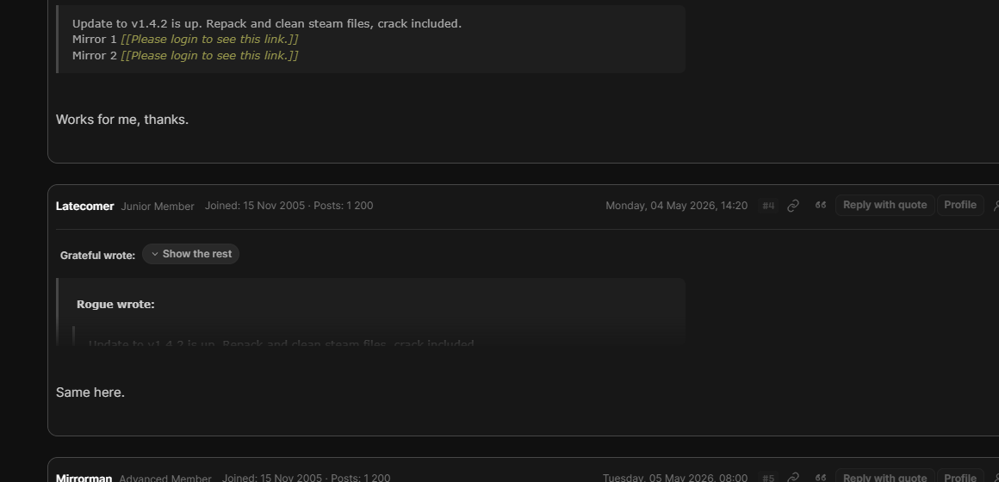
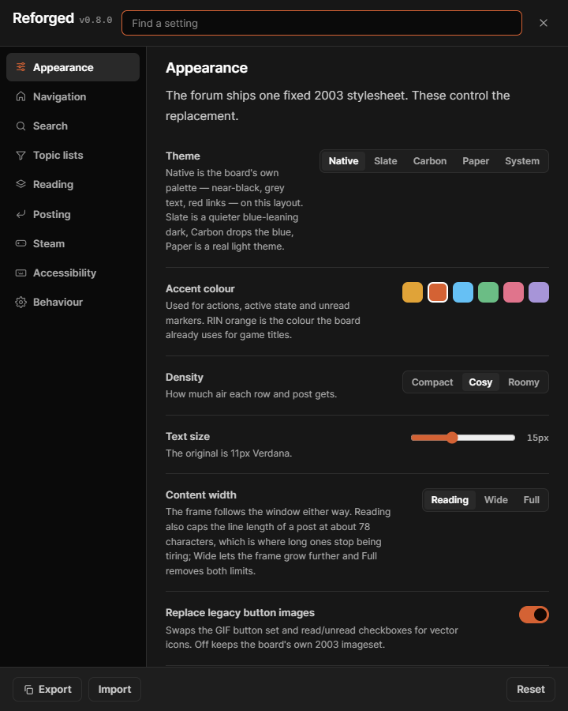

# Design notes

Why RIN Reforged does what it does, feature by feature, and how it is
built and tested. The [README](../README.md) is the short version.

## What it does

### It looks like this decade, and still looks like this board

- **Four themes.** **Native** is the board's own palette — near-black
  neutral, grey text, its red links — on this layout, and it is the
  default. Slate is a quieter blue-leaning dark, Carbon drops the blue,
  Paper is a genuine light theme. Or follow the system setting.
- **Six accent colours**, defaulting to the orange the board already
  uses for game titles.
- **The board's masthead art is kept**, at the size the board draws it,
  on the index. A crosshair over a Steam valve with CS.RIN.RU beside it
  is what this board looks like; a redesign that shows a 26px crop of
  the wordmark and nothing else looks like any forum at all. It shares
  its row with the board links rather than sitting above them, so the
  art anchors the left of one header band instead of leaving a thousand
  pixels of nothing beside it — and the first listing row on the page
  you land on is about a hundred pixels higher for it. Under 900px they
  stack again. Everywhere else the top bar carries the wordmark and the
  content starts at the top.
- **Readable text.** 15px in a system sans, adjustable from 12 to 20, with line
  length capped where long posts stop being tiring.
- **The page follows the window.** The frame was a fixed 1200px column,
  which on a 1920px screen is 350px of nothing down each side and left
  the board's own masthead art marooned in the middle of a black field.
  It is fluid now, up to a ceiling: the window's width to about 1640px
  and steady above that. The line length of a *post* is a separate
  setting and still capped, so a wider frame gives the listing, the
  pager and the releases panel more room without giving prose
  200-character lines.
- **Numbers you can read.** 3097072 is a length rather than a number.
  Counts are grouped — 3 097 072 — with a narrow no-break space rather
  than a comma, which is a decimal point to half this board. Only
  quantities: an AppID, a post number and a Steam build id are names
  spelled in digits and are left alone. Each counting column is right
  aligned on tabular figures, and each heading is aligned with the
  column under it, which they were not.
- **Three densities.** Cosy, the default, gives a listing row about 60px
  against the original board's 34; Compact is the original
  information-per-screen for anyone who wants it back; Roomy is a long
  reading session.
- The 340px masthead becomes a 48px sticky bar carrying the breadcrumb,
  search, private messages and settings.
- The 2003 GIF interface — beveled read/unread checkboxes, image buttons,
  arrow icons — is replaced by vector icons and real buttons.

### It works on a phone

The board ships no viewport tag and lays every page out in nested fixed
tables, so a phone gets a 1000px page scaled down to unreadable, plus
horizontal scrolling. The script injects the viewport tag and unpacks the
layout tables into stacked blocks. Topic rows become a title with a muted
meta line; posts put the author on one line above the message.

| Before | After |
| --- | --- |
|  |  |

### It answers "where is the current version"

This is the thing the board is genuinely bad at, and every guide to it says
so: you open a thread with hundreds of replies and hunt with Ctrl+F.

- **Releases** is one panel with two scopes.

  **This page** lists the posts in front of you that carry links, a
  version or a reupload — newest first, with who posted them and when.
  One click jumps to the post and flashes it.

  **All N pages** reads the whole topic, once, and lists *everything*
  ever posted in it: every release, update, repack, crack, clean Steam
  files drop, online fix, DLC unlocker, trainer, language pack and
  tool — each with its version, what kind of thing it is, who put it
  up, when, and which page it is on. The highest version anybody posted
  is called out at the top, which is the question the thread was opened
  with. Filter chips narrow it to one kind.

  A post is read on its own words: quoted text is excluded, so a reply
  quoting a release is not a second copy of it — and the *prose* is
  what gets classified, not the link labels, so a topic where everyone
  labels their links "Mirror 1" does not come back as fifteen
  reuploads.

  **It reads the version the way the poster wrote it.** Not every game
  numbers its releases with a v: Ubisoft ships *Title Updates*, and the
  release posts say so in the publisher's words — "Game version is
  Title Update 1.0.7". A pattern that wanted a v found no version at
  all in thirty-three pages of one. `TU 1.0.7`, `Updated to 1.2.4` and
  a version welded to the next line by a `<br>` all read correctly now,
  and `1.06` and `1.0.6` are recognised as the same release rather than
  the first being read as one-point-six and winning.

  **A hypervisor crack says so.** It is a release of its own kind on
  this board, with its own how-to threads and its own thing to know
  before downloading sixty gigabytes, and the posts announce it in the
  title line — "…Resynced HYPERVISOR", "on HV releases". Both spellings
  are recognised and it is coloured as what it is: something that makes
  the game run, beside Crack rather than beside Trainer.

  **A bare number is shown and never believed.** "Deluxe Edition
  1.2.3 GOG" names its version with no v and no label, and release
  titles on this board do that more often than not, so a bare
  three-part number now reads as a version — with a date in either
  order, an IP, a price and a Windows build all refused. It goes on
  the row. It does not set the headline: "Updated ACBlackFlagFix to
  2.8.3!" is a mod's changelog with a product name between the label
  and the number, and 2.8.3 beat 1.0.7 to the top of the panel the
  moment bare numbers started to count. Only a version the post
  *called* one — a v, "Title Update", "updated to" — is evidence about
  the game.

  **And somebody else's version is not the game's.** A post explaining
  how to get achievement popups mentions "Download v1.6.0 or later
  lightweight AchievementOverlay"; read as the game's, that beat 1.0.7
  and became the headline. A trainer, a cheat table and an overlay all
  carry their own numbers — only a release *of the game* sets the line
  that answers the question the thread was opened with.

  Reading a topic is a click, never a page load, and reading it a
  second time is nearly free. Every kind of thing the finder can
  recognise has a colour, and the filter chips carry the same colour as
  the rows they filter; a version, a Steam build id and no version at
  all are drawn as three different things rather than three shapes of
  the same one.

  **How it asks the board for pages** is the part worth stating
  plainly, because the board runs on donations. The page you are on is
  never fetched. The rest go three at a time, never two closer together
  than 160ms, and Escape stops it. Pages this browser has already read
  are not fetched again: a second reading of a 34 page topic is **two
  requests instead of 33** — the last page, where new replies land, and
  one page below it whose opening post id proves nothing has shifted.

  And the board is watched while it answers. cs.rin.ru does not send
  429; after a few dozen requests in quick succession it simply starts
  queueing, and six requests sent together come back at two, four, six,
  eight, ten and twelve seconds. Measured, from a browser, with none of
  this script running. So once answers are several times slower than
  the first ones were, the walk drops to one request at a time with a
  much wider gap and says so in the panel. A 429 or a 503 stops it
  outright.
- **Only posts with links** hides everything else on the page.
- **Game info card.** The first post of a game thread is a Steam dump: header
  art, a details block, the full store description, system requirements and
  screenshots. The card keeps the details — AppID, developer, publisher,
  release date, genres, languages — and folds the rest behind one button.
- **External lookups** built from the AppID: SteamDB, the store page,
  SteamCharts, ProtonDB, PCGamingWiki.



Every release in a five page thread, read once:


### It gets you around

- **The board's own wordmark**, cropped out of the masthead art it ships
  rather than redrawn, so the name in the bar is the name on the board.
- **Every masthead link stays one click away.** Forum rules, Donate, Chat,
  FAQ, Register and the English/Russian switch move into a slim row under the
  top bar rather than disappearing with the 340px header they lived in. On a
  phone the row folds to the two entry points and a **More** control.
- **A skip link**, and Escape, Tab and a close button that work in every
  dialog the script opens. The command palette names its highlighted
  entry to a screen reader rather than leaving it to the colour.
- **Reduced motion is respected everywhere**, including the seven places
  the script scrolls the page — a `behavior` passed to `scrollTo` beats
  the CSS property by design, so the setting only means anything if the
  code reads it back.
- **Ctrl+K** opens search, board jumps, bookmarks, recent topics and every
  script action in one box. Ctrl+click or middle-click an entry to open it in
  a new tab. Its searches ask phpBB for one row per topic (`sr=topics`), the
  way the board's own boxes do, instead of one row per matching post.
- **Keyboard shortcuts**: `j`/`k` between posts, `n`/`p` between pages,
  `g` then `i`/`f`/`t`/`b`, `r` to reply, `s` to search, `?` for the list.
- **A real pager.** phpBB never links the last page of a long thread, which is
  exactly where an update thread is read. First, Previous, a page number you
  can type into, Next, Last.
- **Filter as you type** over the topics on the current page, plus one-click
  filtering by `[Info]`, `[Release]`, `[Problem]` and the rest, which become
  coloured tags instead of bracketed text. Under five rows the filter box,
  the count and the chips are not drawn at all: a box that searches a list
  you can already see all of, a count reading "1 on this page" and a chip
  that filters one row down to one row are furniture. The prefix stays,
  as a label rather than a control that answers nothing.
- **One search box, not three.** The board writes its refine box into the
  breadcrumb strip at the top of the page *and* the one at the bottom, and
  a search results page adds a third copy in its own header — same search,
  three boxes, two different button captions. One survives, in the filter
  bar beside the page filter.
- **Read state is said once.** The 2003 read/unread checkbox became a dot,
  and a read one was a filled dot in the line colour: a smudge on a dark
  page, and a whole column of them saying nothing on a listing where every
  row is read. It is a ring now, in the same grey as the meta text, and a
  topic this browser has already been to fills the ring in. The title used
  to be greyed out to say the same thing a second time, which put two faint
  marks on one fact and cost the title its contrast; it keeps it now.
- **Topic titles open where you stopped reading.** phpBB can jump to the
  first unread post in a topic, but only from a small arrow beside the
  row; clicking the title drops you on page one of a thread you are on
  page nineteen of. On rows that actually have unread posts, the title
  now goes to the same place the arrow does. Logged out, nothing
  changes — unread state is per account.
- **The donation link is marked.** The board is hosted on donations and
  is currently asking for them, and its own link to that page was one
  of six greys in a row. It keeps the board's wording and destination
  and gains an outline and a heart. On a phone, where the rest of the
  row folds away, it stays.
- **Bookmarks and history**, kept in this browser, so they work logged out.



### It can show you the game before you open the thread

Three separate userscripts exist for this board whose whole purpose is
putting a game's cover next to a topic title, which makes it the
clearest thing its readers have asked for. Hovering a topic title — or
reaching it with Tab — shows the cover, the review score, the tags, the
release date and the opening lines of the store description.

Half of it costs nothing. The game info card already reads an AppID out
of the first post of every game topic you open, and that AppID is now
kept against the topic, so a thread you have opened once previews
instantly out of this browser with nothing asked of anybody.

The other half is the one thing in this script that talks to a server
other than the forum, so it is **off until you turn it on**, it says so
in the panel, and it is refused outright on the Tor mirror whatever the
setting says. A game name is all that is ever sent; the answer, and the
absence of one, are both cached.

It also needs your userscript manager to grant `GM_xmlhttpRequest`. The
forum answers `connect-src 'self'`, so a request the page makes itself
never leaves — and rather than let that fail as "Steam has nothing under
that name", which is what it looked like the first time this ran against
the live board, the script declines to start the lookup and says which
of the four reasons it is.

### It makes posting less of a trip

- **Reply from the foot of the thread.** The board's own reply form is loaded
  in place, so you keep your position in a long topic. The form that gets
  submitted is the board's, tokens and all.
- **Quote what you select.** Highlight text in a post and a Quote button
  appears; it goes into the reply box when one is open, and onto the clipboard
  when it is not.
- **An unsent reply is kept.** What you have typed into the quick reply is
  held in this browser against that topic, so following a link and
  coming back does not lose it — the button then says *Finish your
  reply*. Cleared the moment the reply is sent, dropped after a month,
  and never sent anywhere.
- Per-post actions on hover: copy link, copy as a quote, reply with quote, and
  a post number to link to.
- **Long quotes fold.** A reply that quotes three paragraphs to add one
  line is clipped to its opening lines, with a control to open it. The
  quote is never taken out of the page: find-in-page still finds it, a
  screen reader still reads it, and the finder still sees it. Only the
  box drawn around it is smaller.
- **The "thanks!" wall folds too**, if you want it to. Short replies that
  carry no link, no version, no image, no code and no question collapse
  to one dim line you can click open — decided from what a post says,
  never from who wrote it. Off by default.
- Long signatures fold. All spoilers open at once. Images open in a lightbox.
  Off-site links show their destination host.



### It works signed in

Nothing a fixture can show and nothing a sweep can reach: the member
list, the message folders, the control panel, the posting form and a
profile exist only for an account. A pass through them with one found
the same board underneath, with the same habits, in places the earlier
work had never looked.

- **Columns have names there too.** "Joined", "Sent", "Rank", "Subject"
  join the listing's column names, so a message folder's dates lose
  their weekday and stop wrapping, the member list's ranks lose their
  Russian half (kept on the title, as everywhere), and a profile's
  "Joined: Thursday, …" reads like every other date on the site. A
  spanning header means "the title column" only on a listing; a
  profile's *User statistics* spans a label and a value and is left
  alone.
- **A member's topic actions are topic actions.** subsilver2 prints
  Subscribe topic, Bookmark topic and E-mail friend for members in the
  same strip as the reply button, with a second "First unread post" at
  the far end. They join the bar's second row, once, and the strip
  goes — properly: a hidden cell's `|` still shows up in `textContent`,
  and the first attempt left a 20px band with nothing in it.
- **The posting form.** The BBCode buttons had `width: 40px` typed into
  them and 16px of padding on each side, so "Quote" was drawn in an 8px
  box. The font colour palette was 141 links of 7×6px around spacer
  gifs — a click target smaller than a full stop — now 14px squares
  flowed nine to a row, the height of the message box beside them. On a
  phone the narrow layout had stacked them into a 2 250px column.
- **Alignment, measured.** The board bar's group divider was drawn
  before the first group of a wrapped line, 25px before "Forum rules"
  and under nothing; the *Releases* title sat 6px above its own row
  because `html[data-rr] h3` outranks the panel's rule; a post's tools
  came in three heights; a message folder's subjects started 8px apart
  depending on an invisible marker; a page short enough for no
  scrollbar moved everything 8px. Each of these is a number now, and
  the number is zero.
- **Radios and checkboxes** are 15px, a gap from their word, and take
  the accent. The control panel's section links looked like headings;
  they are links and are coloured as links.
- **A second reading of every screenshot** (0.8.7) found what the first
  had passed over: a closed spoiler kept 50px of box under its header;
  a profile line read "Posts: 2 865Location: preparing for WW3"; the
  board's "Reply to topic" sat 40px above the card that replies; a
  link whose text was its own address wore a host chip saying the
  address again; a closed category pointed right and an open one up;
  "Mark forums read" alone in a band carried a section head's accent;
  on a phone the original profile cell came back under the header that
  had replaced it, every post ended in a "Top" link, the folded board
  bar clipped the first letters of its groups, and a message folder's
  card led with the date; on the light theme the original stylesheet's
  `th a { color: #ccc }` and `li.row2 { background: #232323 }` were
  still being painted. Each of these is one rule or one line now.
- **A third pass (0.8.8)** reached the pages that had still not been
  opened — a message read in full, the watched-topics list, the search
  results as posts, the member search — and the Russian interface (see
  *It reads Russian*). The control panel's breadcrumb, which the board
  leaves at "Board index", now continues with what the window title
  knows: "User Control Panel / View messages". The watched-topics list
  gets the same first-unread arrow as a listing. A search result's
  "Posted: Friday, …" loses its weekday like every other date, and the
  search term is marked with a wash of the warning colour rather than
  the board's pure yellow.
- **0.8.9** put the script's own words into Russian (see *It reads
  Russian*), folded the who-is-online list at the foot of every forum
  and topic the way the index already did (272 names, 360px, behind
  "Show all 272 names"), let embedded players follow the width of the
  post on a phone, and took back a performance regression: the listing's
  style recalculation had gone from 45ms to 283ms on `:has()` selectors
  that a table full of attribute changes kept re-evaluating. The shapes
  those selectors found are now named once by the script, and the
  listing is back at 42ms.
- **0.8.10** dressed the board's other code block. Besides the plain
  `[code]` box the board runs a syntax highlighter, and its box was
  painted #c9c9c9 with #ccc lines, in the middle of a dark post, with
  tokens coloured for that light box: the sweep had been reporting an
  olive link inside it at 1.9:1 on every run, "not lifted" — the lift
  mixes toward the theme's light text colour and a light box cannot be
  reached that way. The box now takes the sunken surface, its header
  the raised one, the tokens the theme's palette; and the lift tries
  the other direction when the theme's colour fails, so the same span
  in a box this script does not know about would still be read.
- **0.8.11** came from a photograph of a phone. The listing card had
  its marker alone on a line, the description run into the title, the
  counters in dark boxes and the last post in a bar the width of the
  card; the marker and the title now share the first line, the
  description sits under the title in the small face, the counters are
  one quiet line and the last post another, and category rows are
  headers rather than cards. And the filter box and the command palette
  looked for what was typed as one run of characters: "cracks
  hypervisor" found nothing in "Hypervisor cracks support", and a second
  word narrowed the list to nothing rather than further. A query is
  words; each has to be somewhere in the title, in any order, with case
  and accents folded away.
- **0.9.0** is the desktop pass: an audit of the script on monitors from
  1280 to 2560 pixels wide, every finding checked against the live board
  before it was acted on, and the ones that survived done together. The
  top bar ran edge to edge while everything under it kept to the content
  column, so on a 2560px screen the brand sat half a metre left of the
  board bar; its contents now follow the column. The member list, the
  message folders and Who is online had none of a listing's treatment —
  no stripes, ragged numbers, headers aligned against their own cells —
  because "is this a listing" was asked as "does it hold a topic link";
  it is asked as a shape now. A form field was as wide as `size="25"`
  said in 2003. The accent used as text on its own soft wash read at
  3.3:1 on Paper; it is lifted until it passes, per accent, per theme.
  Full width capped nothing at all and gave 300-character lines. The
  Releases panel read a long topic up to page 80 and stopped, which on
  a 120-page topic meant the forty newest pages — where the latest
  release is — were the ones never read; the cap is on requests now,
  the oldest pages are the ones dropped, and the panel says so.
  "Updated from 1.0.5 to 1.0.7" was read as 1.0.5. Carbon kept Slate's
  blue links. The whole title cell opens its topic, since the whole row
  already lit up as if it would. `j`/`k` walk the rows of a listing.
  The lightbox has a close control and holds the keyboard. Every
  signature is set apart, not only the long ones. Toasts are announced.
  The quick reply has a toolbar. "Export" said settings and copied the
  drafts too. Two settings that did nothing now do what they said, and
  the Releases panel speaks Russian to the end. Not done, on purpose:
  post media stays capped at the prose measure, because a post's text
  is bare text nodes and the measure has to sit on the body that holds
  them; Reading mode instead closes the frame in on a topic page, and
  Wide and Full let the images grow with the text. Native keeps the
  board's red on both Important and Problem, and Info stays blue on
  every theme; those are the identity, not oversights.

### It reads Russian

The board is bilingual and half of it reads the Russian interface. The
first version of this script read English: column headers, "Page 1 of
19", "[ 239 posts ]", "Go to page", weekdays, "Joined:", "Posts:",
"Posted:". On a Russian page none of that matched, so the counts went
ungrouped, the dates kept their weekday, the last-post column ran to two
lines, the board's own page counters stayed on screen, the bar had no
pager and the post header had no date. Worse: a guest who switches the
board to Russian gets `lang=ru` stamped on every navigation link, and
the script took each of them for a language link — Rules, FAQ, Register
and Search became a row of pills that all said "RU" while the bar behind
them emptied.

Every one of those strings now has its Russian twin — Темы, Сообщения,
Ответы, Автор, Просмотры, Последнее сообщение; Страница N из M;
[ Сообщений: N ] and [ Тем: N ]; На страницу; the seven weekdays;
Зарегистрирован, Сообщения, Откуда; Добавлено — and a language link is
one that carries a flag, is named for a language, or has nothing but the
language in its query. Two things learned on the way: a JavaScript `\b`
is ASCII-only and never fires next to a Cyrillic letter, so "из 20" has
to be matched with whitespace rather than a word boundary; and a
two-language rank is localised in *either* direction — "I live here Три
раза сломал клаву" reads "I live here" on the English interface and
"Три раза сломал клаву" on the Russian one.

The script's own words followed in 0.8.9: Reply, First unread, Open all
18 spoilers, the pager, the Releases panel and its kinds, the who-is-
online fold, the quick reply, the top bar and the command palette all
read in Russian on a Russian page (`src/core/i18n.js`, one table, each
English string beside its Russian; counts take the three Russian
plural forms — 1 спойлер, 3 спойлера, 5 спойлеров). The settings panel
stays in English: it is long, it is read once, and a half-translated
panel would be worse than an English one.

### It is readable, and that is a measurement rather than an opinion

Four themes and about forty colour tokens, every one of them chosen by
eye against a screenshot. That is the right way to choose a colour and
the wrong way to check one: "muted grey on a dark surface" is a
judgement and 3.9:1 is a number.

`test/contrast.js` walks every element that draws text on five pages
across all four themes — 8 748 of them — works out what colour that
text really is against what is really behind it, compositing back up
the tree through every tint on the way, and measures the pair against
the WCAG AA threshold for its size. It fails the run on anything this
script paints.

The first run found sixty pairs below the line. Almost all of them
were one token: `--rr-faint`, which carries the rank under a name, the
date on a release row, the page label in the pager and "108 on this
page", and which measured between 3.1 and 4.0 on every theme. It is
now the smallest lift of the same hue that clears 4.6 against all three
surfaces it is ever set on. The tags were the other cluster: a hue on a
15% tint of itself is a good way to draw a label and lands just under
4.5 at 12px, so the *ink* is nudged toward whichever end of the theme
it needs — lighter on a dark theme, darker on a light one — while the
tint and the border stay on the pure colour.

Two of the findings were bugs rather than choices. `html[data-rr] a` is
(0,1,1) and `.rr-skip` is (0,1,0), so the one control on the page whose
whole job is to be unmissable was drawing the board's link red on the
accent, at 1.2:1, and only its `:focus` rule was putting that right —
correct by luck, on the only state anyone sees it in.

**The board's own colours are kept and lifted too.** phpBB paints a
username from the group it is in, inline, per user; several of those
land at 2.5:1 on the dark themes and 1.9:1 on the light one, on the
header of every post and the last line of every listing row. Keeping
them is not in question — those colours are how this board tells you
who is talking. So the hue is kept and mixed toward the theme's own
strongest text colour by the least it takes to reach the line. The
board's `#BF0000` becomes `#d76060`: the same red, quieter, readable,
and near the softened red this script had already chosen for its links.
The first attempt raised the lightness instead, which keeps the
saturation and produced pure `rgb(255, 38, 38)` — readable, and neon.
It has its own switch, because a board's colours are part of how it
looks.

### Settings

Every feature above has a switch, with a sentence saying what it does
rather than a variable name. The panel is a rail of nine categories —
Appearance, Navigation, Search, Topic lists, Reading, Posting, Steam,
Accessibility, Behaviour — beside the controls, because a flat scroll of
sixty rows is a list, not a panel.

It is generated from one schema, so it always matches what the script
actually does; a test fails if a feature is added without a control. The
search box looks across every category at once and the rail says how
many each one holds, because a setting you half remember the name of is
not one you know the category of. Export copies your settings and data
as JSON; import takes it back.



## What it does not do

- It does not bypass anything. Links hidden behind "Please login to see this
  link" stay hidden; the reply form is the board's own; nothing is scraped
  from pages you are not entitled to.
- It does not remove the donation overlay. The board is hosted on donations.
  The overlay is restyled and made closable with Escape, and its cookie is
  respected.
- It does not touch post content. Posts are moved, folded and restyled, never
  rewritten. Folding a quote or a short reply in particular is
  `overflow` and a mask, never `display: none` and never a rebuilt
  node: either one is still laid out, still in the accessibility tree,
  and still found by the browser's own find-in-page. (The two older
  folds — a long signature, and the Steam boilerplate in a first post —
  do hide their content, and always have; so does *Only posts with
  links*, which is a filter rather than a fold.) That distinction is the
  reason an earlier attempt at folding quotes was thrown out. Printing
  unfolds everything, because paper has nothing to click.

## Building

The sources in `src/` are plain scripts sharing one scope, stitched into a
single userscript. No dependencies, no transpiling.

```sh
node build.js          # -> dist/rin-reforged.user.js
node --check dist/rin-reforged.user.js
```

Because the scope is shared, every top-level name in `src/` has to be unique;
the build fails loudly if two files declare the same one.

```
src/
  header.txt          userscript metadata
  core/
    store.js          settings and data, GM_* with a localStorage fallback
    schema.js         the settings catalogue — one entry per feature
    dom.js            element helpers, icons, toasts, clipboard
    page.js           everything that knows about phpBB markup
    pagination.js     working out page offsets phpBB does not link
  modules/
    theme.js          theme attributes and the viewport tag
    icons.js          replacing the legacy GIF interface
    settingsui.js     the settings panel, generated from the schema
    navbar.js         the top bar
    lists.js          forum and topic listings
    boardindex.js     the index page
    topic.js          reading a topic: game card, post layout, tools
    finder.js         reading a post as a release: links, version, score
    releases.js       the releases panel — this page, or the whole topic
    quotes.js         folding long quotes without removing them
    quiet.js          folding short low-value replies, by what they say
    steam.js          the hover preview, its cache and its one request
    compose.js        quick reply and selection quoting
    people.js         hiding someone, jumping to the first unread post
    palette.js        the command palette
    shortcuts.js      keyboard navigation
    chrome.js         reading progress and jump buttons
  styles/             tokens, forum reskin, components, features,
                      responsive
  main.js             boot
```

### Testing

`test/` renders saved copies of real board pages with the built script
attached, so changes can be checked against the actual markup rather than an
idealised version of it.

```sh
node test/make-quotes-fixture.js   # regenerates the synthesised fixtures
node test/make-member-fixtures.js  # the pages only a member sees, made up
node test/prepare.js               # builds test/pages from test/fixtures
python test/serve.py               # http://localhost:8731/forum/viewforum.php?f=10
node test/check.js                 # headless pass over every page and setting
node test/features.js              # does each feature still do its job
node test/live.js                  # the same, against cs.rin.ru itself
node test/measure.js               # row heights and card padding, as JSON
node test/scan.js --local --repeat # what reading a whole topic costs
node test/shots.js                 # regenerates docs/screenshots
```

`scan.js` is a stopwatch rather than a check. `--local` reads the
twenty page fixture with the board's own measured latency (0.58s to
first byte) added to every request, which makes the number repeatable;
`--live` reads a real topic and reports how much of the run was the
board answering. Both count requests and peak concurrency, because on
this board those are the numbers that matter more than the clock.

`prepare.js` stamps each generated page with a hash of the bundle it baked
in, and both checkers refuse to run when that does not match `dist/`.
Forgetting to rebuild used to produce a full page of passing results
describing the previous build.

The fixtures cover the board index, a forum listing, a game thread, a page of
replies and a profile. `test/make-quotes-fixture.js` synthesises five more,
for cases none of the saved threads happens to contain:

- a release followed by replies that only quote it — what the finder used
  to get wrong;
- the same thread seen by a logged-in member on an open topic and on a
  locked one, because the quick reply exists only for them;
- ten short posts, five of them chatter and five of them not, one per
  reason a short post must survive the noise filter: a question, a
  problem report, a link, a version number, and plain length. A test
  that only proved the folding works would pass on a filter that folded
  everything;
- the listing as a member sees it, with unread rows, because every saved
  page is a logged-out view where no row is unread and the first-unread
  routing could not be tested at all;
- a five page release thread — thirty posts, sixteen of them things
  somebody posted and the rest chatter, a duplicate mirror and a reply
  that only quotes a release. Reading every page of a topic cannot be
  tested against one page of one topic, and `serve.py` grew a
  `translate_path` so `?start=N` picks a different file, which a static
  server does not do;
- the board's reply form, so the quick reply can actually open in the
  harness and the draft it keeps can be tested by using it rather than
  by poking at storage;
- **a topic that fits on one page.** Every other saved page is a page
  of a long thread, so the short case — which is most of the board —
  had nothing to be tested on, and "Page 1 of 1" was still being drawn
  with no check noticing;
- **the member-only strip of topic actions**, which the board writes
  with the bars between its links typed into the template beside each
  link rather than generated between the ones that survive. Logged out
  the whole strip is empty, which is why `Unsubscribe topic | Bookmark
  topic | | E-mail friend` and a lone `|` hanging off the right-hand
  edge of a full-width cell had never been seen by anything here;
- **a page of search results, and the same page with one result on
  it.** Search is a listing the board draws from a template of its own:
  a header row shaped differently from a forum listing's, a refine box
  written into the page three times over and a "Sort by" strip. Nothing
  saved here was one, so `[ Search found 1 match ]` was being drawn
  with a filter box over it, a count reading "1 on this page" and a
  chip filtering the one row — and the heading `Topics`, which on the
  index names a *counting* column, was taking the marker gutter and the
  full-width title column off the page with nothing noticing.

`test/make-member-fixtures.js` makes three more that no saved page could be:
the member list, a private message folder and a member's profile, with
made-up names and dates. They carry the shapes the first signed-in pass
found — a two-language Rank column, a Sent column, a marker in front of some
subjects and not others, a profile header spanning a label and a value — and
nothing of anybody's account. A real member page is never saved as a
fixture; it is somebody's inbox.

`check.js` also measures the frame at 1280, 1600, 1920 and 2560: it has
to reach 78% of the window or its ceiling, whichever comes first, may
not pass the ceiling, and every full-width block has to follow it. A
fixed 1200px column fails all three at 1600 and above, which is how the
old default was found rather than argued about.

`check.js` proves the script does not throw and the page does not overflow.
`features.js` asserts what a reader would notice — that the board's rules, FAQ,
chat, donation page and language switch are still one click away, that no
control has been left clickable but invisible, and that the finder lists each
upload once. Both suites run against the same pages.

Three of its checks are about the network rather than the page. A check
marked `offline` refuses every request that leaves the test origin and
reports what was attempted, which is how "this reads the cache and talks
to nobody" is proved rather than asserted; a check marked `stub` answers
Steam's two endpoints with canned JSON, so the lookup path is exercised
without asking Valve anything. Both found real bugs on their first run —
a request queue that deadlocked whenever a lookup needed two requests,
and a fold threshold that folded quotes it then failed to clip.

`sweep.js` goes further: fifty live pages — the index, every English
forum and two Russian ones, thirty topics chosen off the listings for
their prefix and their size, and the last page of every long one — with
the bundle at document-start, each asked the same twenty questions.
Overflow, duplicated bars, text under 11px, nameless controls,
separators that separate nothing, Russian in an English rank, a date or
a build id read as a version, broken images, empty boxes, runs of `<br>`
left as spacing, a bar that has become a stack, the board's own pager
still showing, ungrouped counts, coloured text still dim after the
lift, two controls to one destination, clipped text, kindless rows,
focusable ghosts. Its first run found four real things on nearly every
page — the board's "Page 1 of 615" band still drawn on every listing,
`<br>` spacing doubled with the blocks' own margins, a 9px label, and a
sweep-side measurement that disagreed with the script about what was
behind a span — and three false positives, which were fixed in the
sweep. It is paced at one page every two seconds because the board
queues clients that ask faster; see the note on rate limiting above.

The same sweep runs at any width and with any settings — `--width 390`,
`--settings '{"theme":"paper"}'`, `--settings '{"quietPosts":true,
"foldQuotesLines":3}'` — because a phone is a different layout, the
light theme is a different palette, and the features that ship switched
off had only ever been exercised on fixtures. All three came back
clean, once the sweep stopped counting the breadcrumb's deliberate
ellipsis as clipped text.

Four interaction probes went further than reading: Tab through a live
topic (sixty stops, none on anything invisible, the skip link first),
Ctrl+K on a live listing, every one of the fifty-four settings flipped
off and on in place on a live page, and the releases panel read whole
on real topics of different shapes. Two things came out of them. A
submit button had no focus indicator: the rule that swaps the ring for
an accent border on a focused field matched `input` as a whole, and a
submit button is an input with no border to colour. And a multi-page
topic whose first page carried no release had no panel at all — which
is the shape a request thread takes once the request is answered, and
the panel is the only route to the page that answered it. A one page
topic with nothing on it still gets none: there, "nothing here reads as
a release" is the whole answer.

The sweep also takes `--url` for a shape the tour does not reach — the
two search result pages a guest can open, run at three widths and on
the light theme, came back clean — and a print probe found the two
things the print stylesheet had left behind: the skip link, which is
`position: fixed` and translated off the top, and which print media
draws at the head of every sheet; and collapsed signatures, the one fold
that hides its content outright rather than clipping it, and the one
fold that stayed shut on paper. Both fixed; both now checked under
`media: "print"` in the harness.

A last pass over the saved pages looked for what was left of the 2003
template in the rendered DOM. Most of it is invisible — `&nbsp;`
indentation inside a `<select>`, 150px tables inside a cell the modern
layout hides — but the board's spoiler *Show* button is `font-size:
10px` typed into the tag, under the 11px floor everything else on the
page is held to, and it had gone unreported through four sweeps because
the question about small text asked td, p, span and a, and this is an
input. Lifted with an inline style, which is the one thing that wins
against the `<style>` the board injects for those controls; the sweep
asks about inputs and buttons now.

`live.js` runs the built bundle against cs.rin.ru with `addInitScript`, which
executes it at document-start the way a userscript manager does. It is
read-only: it opens pages, reads the DOM and closes. It has already earned its
place twice — the board serves two different masthead files and the wordmark
sits in a different place in each, and the video embeds in a game thread
enforce a Trusted Types policy that `innerHTML` and `DOMParser` both fall foul
of. Neither is visible from the fixtures.

They are a starting point, not a substitute for the live board. The harness
inlines the bundle at the end of `<body>`, while the real script runs at
`document-start` — so three real bugs (running before `documentElement`
existed, a `MutationObserver` on a null node, and a row still painting
near-black on the light theme) only showed up against cs.rin.ru itself.

To check against the live board, load the built file with `addInitScript`,
which runs at document-start the way a userscript manager does:

```js
const ctx = await browser.newContext({ viewport: { width: 390, height: 844 } });
await ctx.addInitScript(fs.readFileSync("dist/rin-reforged.user.js", "utf8"));
const tab = await ctx.newPage();
tab.on("pageerror", console.log);
await tab.goto("https://cs.rin.ru/forum/viewtopic.php?f=10&t=133316");
```

`check.js` loads each of them at three widths and across six settings
combinations, and fails on script errors, horizontal overflow, text under
11px, features that did not attach, and — on the light theme — any block still
painting itself near-black, which is how a missed selector shows up. It needs
a Chromium binary:

```sh
npm i -D playwright-core
RR_CHROME=/path/to/chrome node test/check.js
```
